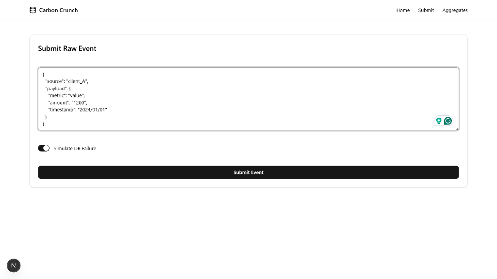
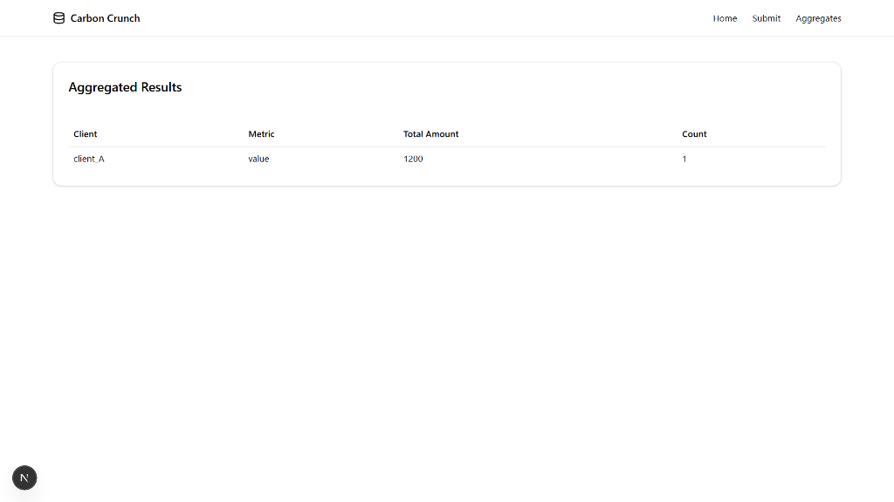

# Fault-Tolerant Data Processing System

A robust full-stack application designed to ingest unreliable client events, handle retries safely through deterministic deduplication, and provide consistent aggregated views of the data.

## 🚀 Key Features

*   **Fault-Tolerant Ingestion**: Capable of handling database failures mid-request without data loss.
*   **Idempotency & Deduplication**: Uses deterministic keys to ensure that re-sent events (due to client retries) are never double-counted.
*   **Data Normalization**: Separates raw payloads from processed business entities.
*   **Real-time Aggregation**: On-the-fly calculation of metrics from processed events.
*   **Simulation Mode**: Built-in toggle to simulate database failures for testing retry logic.

## 🛠️ Tech Stack

### Backend
*   **Node.js & Express**: API server.
*   **MongoDB & Mongoose**: specific data modeling for `RawEvents` and `ProcessedEvents`.
*   **Architecture**: Layered architecture (Routes -> Controllers -> Services -> Models).

### Frontend
*   **Next.js 16 (App Router)**: Modern React framework.
*   **TailwindCSS**: Styling and responsive design.
*   **Shadcn/UI & Radix UI**: Accessible and customizable components.
*   **Framer Motion**: Smooth animations (e.g., `MotionCard`).

## 🏗️ Architecture & Design Decisions

### Data Flow
1.  **Ingest**: Client sends JSON payload to `POST /ingest`.
2.  **Raw Capture**: System *always* saves the `RawEvent` first (status: 'received').
3.  **Processing**:
    *   Normalizes the raw payload.
    *   Generates a deterministic **Deduplication Key**.
    *   Attempts to save `ProcessedEvent`.
4.  **Idempotency**: If `ProcessedEvent` already exists (checked via unique index on dedup key), the system ignores the duplicate but returns success to the client, ensuring safe retries.
5.  **Aggregation**: `GET /aggregates` computes results on demand using MongoDB aggregation pipelines.

### Assumptions & Strategy
*   **Clients Retry**: Clients are expected to resend events indefinitely until they receive a 200 OK.
*   **No Data Loss**: Raw data is preserved even if processing fails.
*   **Eventual Consistency**: Acceptable for this use case.
*   **Handling DB Failures**: Transactions (implied) or atomic operations prevent partial writes.

## 📸 Screenshots

### Submit Raw Event
Test the ingestion pipeline with the "Simulate DB Failure" toggle to verify client-side retry handling.



### Aggregated Results
View the processed data grouped by client and metric.



## 🏁 Getting Started

### Prerequisites
*   Node.js (v18+)
*   MongoDB running locally or via Atlas.

### Backend Setup
1.  Navigate to the backend directory:
    ```bash
    cd backend
    ```
2.  Install dependencies:
    ```bash
    npm install
    ```
3.  Create a `.env` file (copied from `.env.example` if available) and ensure `MONGO_URI` is set.
4.  Start the server:
    ```bash
    npm run dev
    ```
    *Server runs on http://localhost:5000*

### Frontend Setup
1.  Navigate to the frontend directory:
    ```bash
    cd frontend
    ```
2.  Install dependencies:
    ```bash
    npm install
    ```
3.  Start the development server:
    ```bash
    npm run dev
    ```
    *App runs on http://localhost:3000*

## 📡 API Reference

#### `POST /ingest`
Ingests a raw event.
*   **Body**: JSON object (e.g., `{ "source": "client_A", "payload": { ... } }`)
*   **Returns**: `{ success: true, deduplicated: boolean }`

#### `GET /aggregates`
Retrieves aggregated metrics.
*   **Returns**: Array of aggregated data objects.
